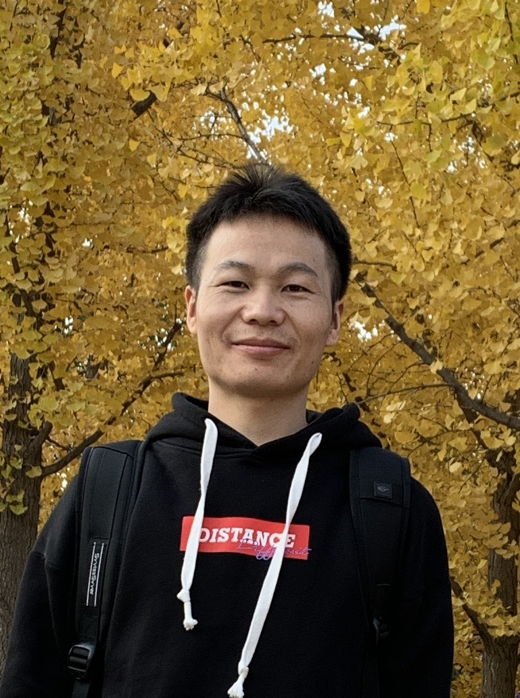

# 李勇  Yong Li 

    

I am an Associate Research Professor within the <a href="https://tis.ios.ac.cn/">TIS group</a> at <a href="http://lcs.ios.ac.cn/"> SKLCS</a>.
I was a <a href="https://marie-sklodowska-curie-actions.ec.europa.eu/">Marie Skłodowska-Curie Research Fellow</a> at <a href="https://www.liverpool.ac.uk/computer-science/">Department of Computer Science, University of Liverpool</a>.
Prior to this, I was a Research Assistant within the <a href="https://tis.ios.ac.cn/">TIS group</a> at <a href="http://lcs.ios.ac.cn/"> SKLCS</a>.

I received my Ph.D. degree at <a href="http://lcs.ios.ac.cn/">State Key Laboratory of Computer Science, Institute of Software, Chinese Academy of Sciences</a> and <a href="https://english.ucas.ac.cn">University of Chinese Academy of Sciences</a>, advised by <a href="https://iscasmc.ios.ac.cn/?page_id=148">Prof. Lijun Zhang</a>.

My main interests are the following:
+ Automata learning [[TACAS17;I&C21](https://tis.ios.ac.cn/roll/lib/exe/fetch.php?media=iandc.pdf), [SETSS18](https://link.springer.com/chapter/10.1007/978-3-030-17601-3_2), [FM21](./pdf/FM2021.pdf), [ATVA23b](./pdf/ATVA23b.pdf), [IJCAI24](./pdf/IJCAI24.pdf), [FM24](./pdf/FM2024.pdf)]

+ Automata theory [[VMCAI18](https://link.springer.com/chapter/10.1007/978-3-319-73721-8_15), [ATVA20](https://arxiv.org/abs/2007.02282), [CAV22](https://arxiv.org/abs/2206.13739), [Henzinger60](https://link.springer.com/chapter/10.1007/978-3-031-22337-2_9), [TACAS23](https://arxiv.org/abs/2301.01890), [CONCUR23;TCS24](https://arxiv.org/abs/2305.09966), [I&C23](https://arxiv.org/abs/2109.12828)]

+ Verification [[TIME16](https://arxiv.org/pdf/1606.08116v2), [PLDI18](https://ondrik.github.io/publications/pldi18-semidet-buchi-compl.pdf), [TCS](https://www.sciencedirect.com/science/article/pii/S030439752200425X), [SEFM22](https://link.springer.com/chapter/10.1007/978-3-031-17108-6_20), [ATVA23a](./pdf/ATVA2023a.pdf)]

+ Synthesis [[AAAI20](https://ojs.aaai.org/index.php/AAAI/article/view/6528), [IJCAI21](https://www.ijcai.org/proceedings/2021/570), [VSTTE22](https://link.springer.com/chapter/10.1007/978-3-031-25803-9_1), [FMCAD24](https://repositum.tuwien.at/handle/20.500.12708/200795)]

Quick links to find me:
+ <a href="https://github.com/liyong31">Github</a>;
+ <a href="https://dblp.org/pid/93/2334-31.html">DBLP</a>.

My contact address: Office 218, Building 5, Software Park, South Fourth St, Zhong Guan Cun, Haidian District, Beijing, PRC

**Email**: liyong AT ios DOT ac DOT cn

  
[CV](./pdf/cv.pdf) | [Experience](#work-experience) | [Education](#education)
| [Honors](#selected-awards-and-honors)  | [News](#news) | [Publications](./publications.md) 

---
## Work Experience

Associate Research Professor, Oct. 2022 - present  
<a href="http://lcs.ios.ac.cn/">State Key Laboratory of Computer Science, Institute of Software, Chinese Academy of Sciences</a>.

Marie Skłodowska-Curie Research Fellow, Oct. 2022 - Oct. 2024  
<a href="https://www.liverpool.ac.uk/computer-science/">Department of Computer Science, University of Liverpool</a>.

Research Assistant, April 2020 - Oct. 2022  
<a href="http://lcs.ios.ac.cn/">State Key Laboratory of Computer Science, Institute of Software, Chinese Academy of Sciences</a>.

## Education

Ph.D. in Computer Science, Sept. 2013 - Jan. 2020  
<a href="https://english.ucas.ac.cn">University of Chinese Academy of Sciences</a> (UCAS).

B.Sc. in Computer Science, Sept. 2009 - Jun. 2013  
<a href="http://www.njupt.edu.cn/en/">Nanjing University of Posts and Telecommunications</a> (NJUPT).

## Selected Awards and Honors
<!-- Your honors content goes here -->
Best Paper Award at ATVA 2023 ([paper](./pdf/ATVA2023a.pdf))

Marie Curie Research Fellow 2022

## Services
Co-Chair: [SYNT 2024](https://synt2024.github.io/)

PC Member: [ATVA 2024](https://atva-conference.org/2024/)

Reviewer: ICALP 2025, FM 2024, CAV 2024, ICALP 2024, FOSSACS 2024, CSL 2024, 
CONCUR 2023, CAV 2023, TACAS 2022, CAV 2021,
FOSSACS 2020, FM 2019, TASE 2019, ICECCS 2018, LMCS

AE PC Member:  iFM 2024, iFM 2023, TACAS 2022, TACAS 2021, TACAS 2019

## News
<!-- Your news content goes here -->
<!-- First 5 news items -->
**April 30, 2025**
Our paper titled "Solving MDPs with LTLf+ and PPLTL+ Temporal Objectives" has been accepted to IJCAI 2025.
This is joint work with [Giuseppe De Giacomo](https://www.cs.ox.ac.uk/people/giuseppe.degiacomo/), [Sven Schewe](https://www.csc.liv.ac.uk/~sven/), [Christoph Weinhuber](https://weinhuber.github.io/) and [Pian Yu](https://sites.google.com/view/pian-yu/home). 

**April 15, 2025**
Our paper titled "Saturation Problems for Families of Automata" has been accepted to ICALP 2025 - Track B.
This is joint work with [León Bohn](https://leonbohn.de/me), [Christof Löding](https://www.lics.rwth-aachen.de/cms/lics/der-lehrstuhl/team/dozierende/~ocsx/christof-loeding/?allou=1&lidx=1) and [Sven Schewe](https://www.csc.liv.ac.uk/~sven/). 

**April 2, 2025**
Our paper titled "Accelerating Markov Chain Model Checking: Good-for-Games Meets Unambiguous Automata" has been accepted to CAV'25.
This is joint work with Soumyajit Paul, [Sven Schewe](https://www.csc.liv.ac.uk/~sven/) and [Qiyi Tang](https://sites.google.com/view/qiyitang/publications). 

**Jan 25, 2025**
Our paper titled "Planning with Linear Temporal Logic Specifications: Handling Quantifiable and Unquantifiable Uncertainty" has been accepted to ICRA'25.
This is joint work with [Pian Yu](https://sites.google.com/view/pian-yu/home), [Dave Parker](https://www.cs.ox.ac.uk/people/david.parker/home.html) and [Marta Kwiatkowska](https://www.cs.ox.ac.uk/people/marta.kwiatkowska/). 

**July 16, 2024**
Our FM paper has been awarded *Available* and *Reusable* badges. Check out our [artifact](https://zenodo.org/records/12528885) and [paper](pdf/FM2024.pdf).  

  
Show More News

<strong>July 9, 2024</strong> 
Our paper titled "DAG-Based Compositional Approaches for LTLf to DFA Conversions" has been accepted to FMCAD'24.
This is joint work with [Suguman Bansal](https://suguman.github.io/) and her undergraduate student Yash Kankariya.

  
<strong>June 11, 2024</strong> 
  Our paper titled "DFAMiner: Mining minimal separating DFAs from labelled samples" has been accepted to FM'24.
  This is joint work with [Daniele Dell'Erba](https://cgi.csc.liv.ac.uk/~dde/) and [Sven Schewe](https://cgi.csc.liv.ac.uk/~sven/).

  
<strong>April 17, 2024</strong> 
Our paper titled "Angluin-Style Learning of Deterministic Büchi and Co-Büchi Automata" has been accepted to IJCAI'24.
This is joint work with [Sven Schewe](https://cgi.csc.liv.ac.uk/~sven/) and [Qiyi Tang](https://sites.google.com/view/qiyitang/).

  
<strong>October 30, 2023</strong> 
Our paper titled "Model Checking Strategies from Synthesis Over Finite Traces" won the Best Paper Award at ATVA'23.

  
<strong>July 1, 2023</strong> 
Two papers are accepted by ATVA'23:

 "On Strategies in Synthesis Over Finite Traces" with Suguman Bansal, Lucas Martinelli Tabajara, Moshe Vardi and Andrew Wells,  

  "A novel family of finite automata for recognizing and learning omega-regular languages" with Sven Schewe and Qiyi Tang. 

  <!-- Remaining news items -->
  
<strong>June 29, 2023</strong> 
Our tool [lisa](https://github.com/liyong31/lisa) has won the third place in the LTLf track at [SYNTCOMP 2023](http://www.syntcomp.org/)! 

  
<strong>June 28, 2023</strong> 
Paper titled ["Singly Exponential Translation of Alternating Weak Büchi Automata to Unambiguous Büchi Automata"](https://arxiv.org/pdf/2305.09966.pdf) accepted by CONCUR'23. 
This is joint work with Sven Schewe and Moshe Vardi.

  
<strong>December 23, 2022</strong> 
  Paper titled "Modular Mix-and-Match Complementation of Büchi automata" accepted by TACAS'23. 
  This is joint work with Vojtěch Havlena, Ondřej Lengál, Barbora Šmahlíková, and Andrea Turrini.

  
<strong>September 6, 2022</strong> 
  Paper titled "Compositional Safety LTL Synthesis" accepted by VSTTE'22. 
  This is joint work with Suguman Bansal, Giuseppe De Giacomo, Antonio Di Stasio, Moshe Y. Vardi, and Shufang Zhu.

  
<strong>August 1, 2022</strong> 
  Excited to present joint work with Moshe on Büchi determinization at <a href="https://vardifest.github.io/">VardiFest</a> to celebrate the pioneering role of Moshe Vardi in many fields. 
  My slide deck is available <a href="./pdf/VardiFest-talk.pdf">here</a>.

  
<strong>July 8, 2022</strong> 
  Paper titled "Synthesizing Ranking Functions for Loop Programs via SVM" accepted by Theoretical Computer Science Journal. 
  <a href="./pdf/Henzinger-60.pdf">This work</a> extends our ICFEM'19 paper by utilizing SVM to learn multiphase ranking functions.

  
<strong>June 6, 2022</strong> 
  Check out our invited <a href="./pdf/Henzinger-60.pdf">paper</a> on Büchi complementation to Thomas Henzinger Festschrift - Conference celebrating his 60th birthday.

  
<strong>June 4, 2022</strong> 
  Submission to CAV-AE 2022 awarded <a href="https://doi.org/10.5281/zenodo.6558928">Available</a> and Reusable badges.

  
<strong>May 1, 2022</strong> 
  Paper titled "Divide-and-Conquer Determinization of Büchi Automata based on SCC Decomposition" accepted to CAV 2022. This is joint work with Andrea Turrini, Weizhi Feng, Moshe Vardi, and Lijun Zhang.

  <!-- Add more news items as needed -->

<!-- ## [CV](./pdf/cv.pdf) -->
<!-- ## [Publications](./publications.md) -->
<!-- Your publications content goes here -->

